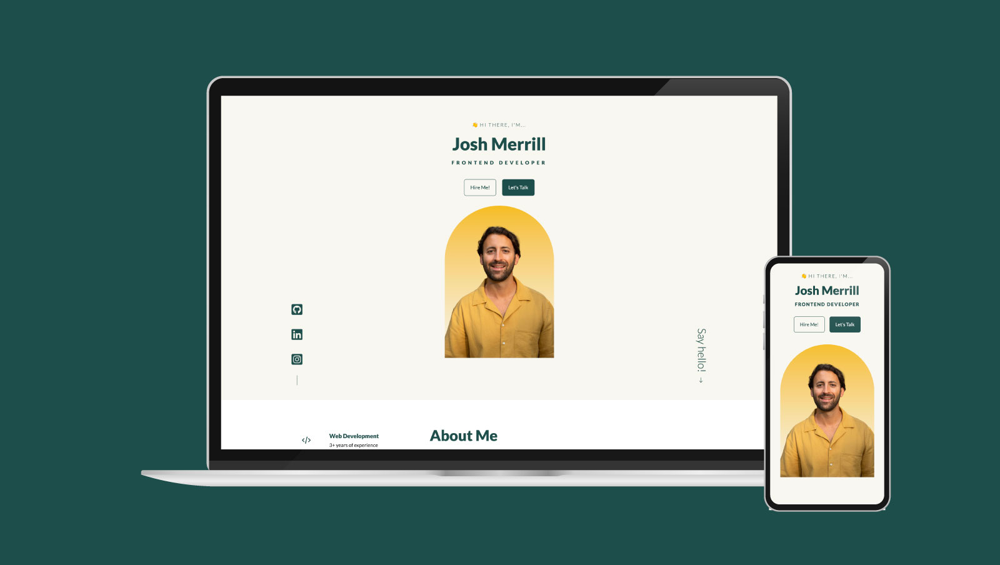

# React Portfolio - Josh Merrill

## About this project

Welcome to my React-based portfolio project! This portfolio showcases my skills as a frontend web developer, highlighting my experience, projects, and ways to get in touch with me.

Learn more about this project below 👇 

## Table of contents

- [Overview](#overview)
  - [Screenshots](#screenshots)
  - [Built with](#built-with)
- [My process](#my-process)
  - [What problem did I set out to fix?](#what-problem-did-i-set-out-to-fix)
  - [What were some of the design decisions?](#what-were-some-of-the-design-decisions)
  - [What I learned](#what-i-learned)
  - [What I would change if I had more time](#what-i-would-change-if-i-had-more-time)
- [Contributing](#contributing)
- [Author](#author)
- [Acknowledgements](#acknowledgements) 

## Overview

**Live Demo**: [https://www.josh-merrill.com](https://www.josh-merrill.com)

### Screenshots

### Built with

- [React](https://reactjs.org/) - JavaScript library for building user interfaces.
- [HTML](https://developer.mozilla.org/en-US/docs/Web/HTML) - Hypertext Markup Language.
- [CSS](https://developer.mozilla.org/en-US/docs/Web/CSS) - Cascading Style Sheets.
- [EmailJS](https://www.emailjs.com/) - For sending emails from the contact form.
- [Icons](https://react-icons.github.io/react-icons/) - React Icons library for adding icons.

### My process

- **Design**: I began the project by planning the website's layout and structure. I created wireframes and a design concept using Figma, ensuring a visually appealing and user-friendly interface.
- **Development**: I implemented the design using React, HTML, and CSS. I leveraged various React libraries and components to enhance interactivity and functionality.
- **Deployment**: The website is deployed using Vite, providing a fast and reliable hosting solution.

### What problem did I set out to fix?

The primary goal of this project was to create a personal portfolio website that showcases my skills and projects in an organized and visually engaging manner. I aimed to present my frontend development expertise through a clean, responsive, and user-friendly interface. By building this portfolio, I wanted to offer potential employers and clients an insight into my capabilities and work.

### What were some of the design decisions?

During the development process, I made several design decisions to create an effective and visually appealing portfolio:

- **Clean and Minimalistic**: I opted for a clean and minimalistic design to focus on the content and keep the user experience simple and distraction-free.
- **Responsive Design**: The website is fully responsive to ensure seamless accessibility on various devices, including desktops, tablets, and mobile phones.
- **Consistent Branding**: I maintained consistent branding elements throughout the website, such as the color scheme and font choices.

### What I learned

Throughout the development of this portfolio, I gained valuable experience and knowledge:

- **Advanced React Techniques**: I honed my skills in React, utilizing components, hooks, and state management to create a dynamic and interactive user interface.
- **CSS Styling and Flexibility**: I explored various CSS styling techniques and used Flexbox and CSS Grid for responsive layout design.
- **Deployment and Version Control**: I learned about deploying a React application and managing version control with Git and GitHub.

### What I would change if I had more time

Given more time, there are a few improvements and additional features I would like to implement:

- **Portfolio Filtering**: Add a feature to filter projects based on categories or technologies used, allowing users to find relevant projects quickly.
- **Interactive Resume**: Create an interactive and downloadable resume section to provide users with a more detailed overview of my skills and experiences.
- **Blog Section**: Introduce a blog section where I can share my insights and knowledge about frontend development and related topics.

## Contributing

Contributions are welcome! If you have any suggestions, improvements, or ideas for collaboration, please feel free to get in touch with me through the contact form or reach out to me on LinkedIn or GitHub.

## Author

- [Josh Merrill](https://www.josh-merrill.com)
- [GitHub](https://github.com/josh-merrill)
- [LinkedIn](https://www.linkedin.com/in/joshmmerrill/)
- [Email](mailto:joshmmerrill@outlook.com?subject=Hello!)

## Acknowledgments

I would like to extend my gratitude to all the dedicated instructors at [Scrimba](https://github.com/scrimba). Their valuable teachings and inspirational solutions have been a constant source of motivation, pushing me to improve and innovate in my web development endeavors.

---

Thank you for visiting my portfolio! I hope you enjoy exploring my projects and learning more about my skills and experience. If you consider me a good candidate for an open position, would like to discuss a freelance project, or just say hello, feel free to contact me on social media or by email. Happy browsing! 🚀
